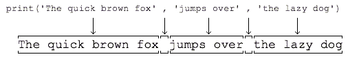

# 输入
input():用户输入字符串，并存放到一个变量中。

返回类型：字符串类型
# 输出
print()：在括号中加上字符串，向屏幕输出指定的字符串
+ 接受多个字符串，用逗号“，”隔开，遇到逗号会输出一个空格
    
+ 可以打印整数或者计算结果
~~~
# print（）：输出函数
# 1、括号内加上字符串，就可以在屏幕上输出指定的内容
print('hello world')
# 2、可以接受多个字符串，用逗号隔开，就可以连成一句话。遇到逗号会输出一个空格。
print('I am', 'woman!')
# 3、可以打印整数，或者计算结果
print(100)
print(100+200)
~~~
# 数据类型
# 变量
# 字符串
# 编码
# 列表：list
# 元组：tuple
# 条件判断
# 循环
# 字典：dict
# set：集合

