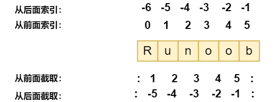

# 输入
input():用户输入字符串，并存放到一个变量中。

返回类型：字符串类型
# 输出
print()：在括号中加上字符串，向屏幕输出指定的字符串
+ 接受多个字符串，用逗号“，”隔开，遇到逗号会输出一个空格
    
+ 可以打印整数或者计算结果
~~~
# print（）：输出函数
# 1、括号内加上字符串，就可以在屏幕上输出指定的内容
print('hello world')
# 2、可以接受多个字符串，用逗号隔开，就可以连成一句话。遇到逗号会输出一个空格。
print('I am', 'woman!')
# 3、可以打印整数，或者计算结果
print(100)
print(100+200)
~~~
# 数据类型
+ 六大基本类型：
    + Numbers（数字）
        + 支持的类型：int（整型）、float（浮点型）、bool（布尔型）、complex（复数）
        + 数值运算：+ - * （加减乘）、/ （除，得到一个浮点数）、// （除，得到一个整数）、%（求余）、** （乘方）
        + 复数由实数部分和虚数部分构成，可以用a + bj,或者complex(a,b)表示， 复数的实部a和虚部b都是浮点型
        
    **注意：** Python3 中，bool 是 int 的子类，True 和 False 可以和数字相加， True==1、False==0 会返回 True，但可以通过 is 来判断类型。
    + String（字符串）
        + 字符串 str 用单引号(' ')或双引号 (" ") 括起来，同时使用反斜杠 (\) 转义特殊字符。
        + 字符串的截取的语法格式：变量[头下标:尾下标:步长]
        + 索引值以 0 为开始值，-1 为从末尾的开始位置。
            
        + 加号 + 是字符串的连接符， 星号 * 表示复制当前字符串，与之结合的数字为复制的次数
    + List（列表）
        + 列表中元素的类型可以不相同，它支持数字，字符串甚至可以包含列表（所谓嵌套）。
        + 列表是写在方括号 [] 之间、用逗号分隔开的元素列表。
        + 和字符串一样，列表同样可以被索引和截取，列表被截取后返回一个包含所需元素的新列表。
        + 列表截取的语法格式如下：变量[头下标:尾下标:步长]
        + 列表中的值是可以改变的
    + Tuple（元组）
        + 元组的元素不能修改。
        + 元组写在小括号 () 里，元素之间用逗号隔开。
        + 截取 同上
        + 注意构造包含 0 或 1 个元素的元组的特殊语法规则。
        ~~~
         tup1 = ()    # 空元组
         tup2 = (20,) # 一个元素，需要在元素后添加逗号
         ~~~
    + Sets（集合）
        + 集合（set）是由一个或数个形态各异的大小整体组成的，构成集合的事物或对象称作元素或是成员。
        + 基本功能是进行成员关系测试和删除重复元素。
        + 使用大括号 { } 或者 set() 函数创建集合，
        + 注意：创建一个空集合必须用 set() 而不是 { }，因为 { } 是用来创建一个空字典。
        + 创建格式：
        ~~~
        parame = {value01,value02,...}
        或者
        set(value)
        ~~~
    + Dictionaries（字典）
        + 字典（dictionary）是Python中另一个非常有用的内置数据类型。
        + 列表是有序的对象集合，字典是无序的对象集合。
        + 字典和列表两者之间的区别在于：字典当中的元素是通过键来存取的，而不是通过偏移存取。
        + 字典是一种映射类型，字典用 { } 标识，它是一个无序的 键(key) : 值(value) 的集合。
        + 键(key)必须使用不可变类型。
        + 一个字典中，键(key)必须是唯一的。
        + 构造函数 dict() 可以直接从键值对序列中构建字典
+ 可变和不可变数据类型：
    + 不可变数据（3 个）：Number（数字）、String（字符串）、Tuple（元组）；
    + 可变数据（3 个）：List（列表）、Dictionary（字典）、Set（集合）。
+ 判断数据类型的方法：
    1. type() ：不会认为子类是一种父类类型
    2. isinstance ：会认为子类是一种父类类型
 
# 变量
# 字符串
# 编码
# 列表：list
# 元组：tuple
# 条件判断
# 循环
# 字典：dict
# set：集合

